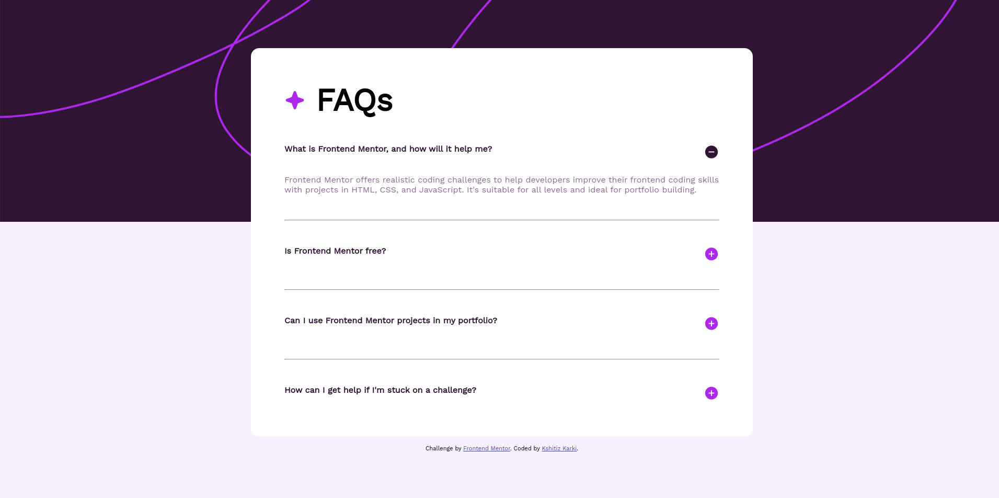

# Frontend Mentor - FAQ accordion solution

This is a solution to the [FAQ accordion challenge on Frontend Mentor](https://www.frontendmentor.io/challenges/faq-accordion-wyfFdeBwBz). Frontend Mentor challenges help you improve your coding skills by building realistic projects.

## Table of contents

-   [Overview](#overview)
    -   [The challenge](#the-challenge)
    -   [Screenshot](#screenshot)
    -   [Links](#links)
-   [My process](#my-process)
    -   [Built with](#built-with)
    -   [What I learned](#what-i-learned)
    -   [Continued development](#continued-development)
    -   [Useful resources](#useful-resources)
-   [Author](#author)
-   [Acknowledgments](#acknowledgments)

**Note: Delete this note and update the table of contents based on what sections you keep.**

## Overview

### The challenge

Users should be able to:

-   Hide/Show the answer to a question when the question is clicked
-   Navigate the questions and hide/show answers using keyboard navigation alone
-   View the optimal layout for the interface depending on their device's screen size
-   See hover and focus states for all interactive elements on the page

### Screenshot

### Links

-   Solution URL: [Github](https://github.com/Kshitiz-Karki/frontendmentor_faq-accordion-main)
-   Live Site URL: [Github pages](https://kshitiz-karki.github.io/frontendmentor_faq-accordion-main/)

## My process

### Built with

-   Semantic HTML5 markup
-   CSS
-   Flexbox
-   Javascript

### What I learned

how CSS properties can be updated dynamically using vanilla javascript.

### Continued development

Would like to add a link to my portfolio for below:-
`Coded by <a href="#">Kshitiz Karki</a>.`

### Useful resources

-   [Blog 1](https://webdesign.tutsplus.com/how-to-build-an-accordion-using-only-html--cms-106881t) - This helped me on how to structure HTML properly first and then apply CSS. Also I came to know that this same functionality can be implemented alternately using 
 tag as well and without any javascript.

-   [Blog 2](https://www.freecodecamp.org/news/build-an-accordion-menu-using-html-css-and-javascript/) - This blog helped me understand on how javascript can be used with HTML and CSS.

## Author

-   Website - [Kshitiz Karki]() (to be added later)
